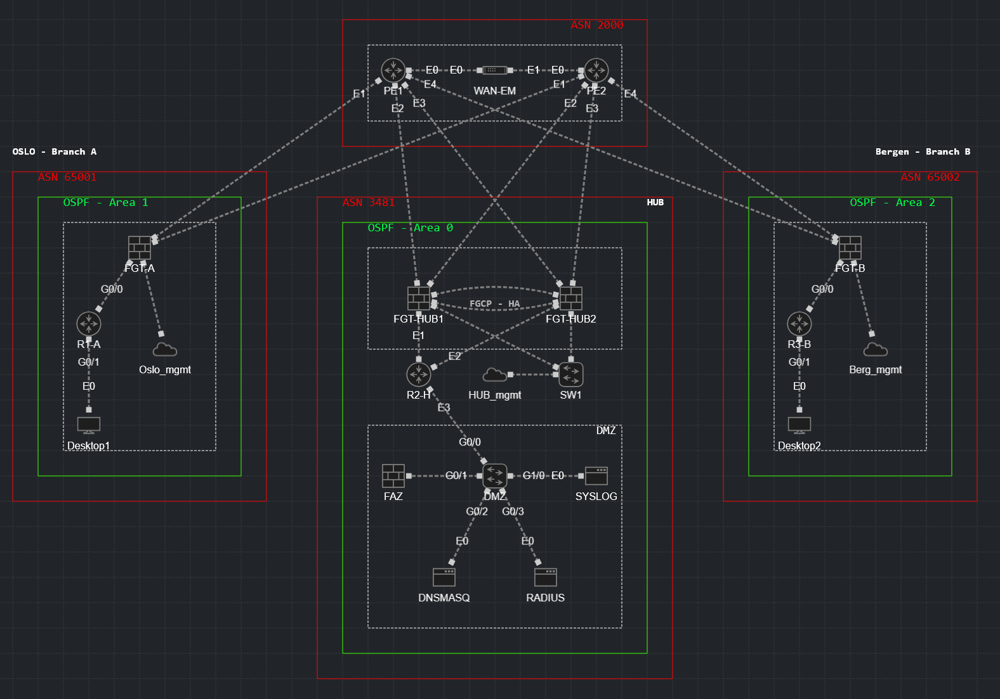

# Project 5 - Fortinet BGP/OSPF Multi-ASN HA Lab Environment

This repisitory features a multi-ASN topology built in CML 2.9.0, focusing on Fortinet **FortiOS 7.6.4** and **FortiOS 7.0.9** for edge security, HA clustering, logging, and routing with OSPF and BGP.

---

## What This Lab Does
This lab simulates a central backhone ASN (3481), to provide transit to two branch ASNs (65001, 65002) via a provider ASN (2000):

- **Fortinet FGCP HA**: Active-passive clustering on HUB-firewalls for redundancy.
- **BGP Peering**: Multi-homed eBGP between branches and PEs; iBGP in backbone.
- **OSPF Areas**: Multi-area setup with Area 0 (backbone), Area 1 (left branch), Area 2 (right branch).
- **Security & Services**: Firewall policies, VPN (IPSec), DMZ hosting analytics/logging/auth.
- **WAN Emulation**: Simulated latency/jitter/packet loss testing.

---

## Network Topology


---

## File Structure

```
├── configs/                             # Device‑specific startup‑configs (.yaml)
├── docs/                                # Network design documentation
│   ├── IP_Plan.md  
│   └── ASN_Plan.md       
├── steps/                               # Step-by-step implementation guides
│   ├── 01_Initial_FortiGate_Setup.md
│   ├── 02_PE_Routers_MPLS.md
│   ├── 03_FortiGate_Interfaces.md
│   ├── 04_OSPF_Configuration.md
│   ├── 05_BGP_Peering.md
│   ├── 06_FGCP_HA_Clustering.md
│   ├── 07_IPsec_VPN_Tunnels.md
│   ├── 08_Security_Policies.md
│   ├── 09_FortiAnalyzer_Integration.md
│   └── 10_DMZ_Services_Setup.md
├── topology/                            # Diagram (.png)
│   ├── project5_multi_asn_topology_unconfigured.png
│   └── project5_multi_asn_topology_configured.png
├── wireshark/                           # Packet capture
└── notes.md                             # Lab journal, troubleshooting    
```

---

## Network Device images

| Device         | Image version       |
| -------------- | ------------------- | 
| FortiGate      | FortiOS v7.0.9      | 
| FortiAnalyzer  | FortiOS v7.6.3      | 
| WAN Emulator   | 3.21.3              | 
| vIOS           | 15.9(3) M10         | 
| FRR            | 10.2.1-r1           | 
| Desktop        | Alpine Linux 3.21.3 | 

## Lab Requirements

| Component   | Requirement                       | Notes                                                                 |
| ----------- | --------------------------------- | --------------------------------------------------------------------- |
| RAM         | 24GB (w/ KSM)                     | FortiGates (2GB each), FRR/IOSv (1GB each), services (2GB total)      |
| vCPU        | 14 vCPUs                          | 1 vCPU per FortiGate HA pair, 2 per FRR/PE, 1 per others              |
| Storage     | 334.10GB free (edit)              | FortiAnalyzer consumes a large amount of storage                      |
| Platform    | CML 2.9.0                         | FortiGate 7.6.3, FRR 8.x, IOSv 15.9, Docker containers etc..          |

Refer to [notes.md](/notes.md) to tune and enable KSM on CML. Do note it would take up to 15 minutes to fully complete the memory de-duplication.

---

## Implementation Steps

**Step 1:** Initial FortiGate setup via console (management) 
**Step 2:** Configure PE routers with BGP and MPLS
**Step 3:** FortiGate interface configuration
**Step 4:** OSPF within each autonomous system  
**Step 5:** BGP peering between FortiGates and PE routers  
**Step 6:** FGCP High Availability clustering (HUB1 + HUB2)  
**Step 7:** IPsec VPN tunnels for branch-to-hub connectivity  
**Step 8:** Security policies, NAT, and application control  
**Step 9:** FortiAnalyzer integration and log forwarding  
**Step 10:** DMZ services (DNS, DHCP, RADIUS, Syslog) 

Each step builds upon the previous step.

These steps will also mostly follow the format below in terms of CLI/GUI usage:
- **CLI** for Steps 1-3 (foundation)
- **GUI** for Steps 7-9 (security settings)
- **Mix** for Step 4-6 (routing - CLI mostly for speed, GUI for verification)

Step 10 is mostly about setting up the docker services in CML.

---

## Notes

This lab builds on from experience and knowledge from my previous labs **Project 1** to **Project 4**, where **Project 5** focuses more on Fortinet **security orchestration** rather than on pure routing. This project was built to demonstrate my CCNP ENT, Cisco SCOR, and Fortinet FCP/FCSS Network Security knowledge in a practical, production-like environment. CML-2.9.0 is limited, e.g. no real WAN variance, so the mean focus is on configurations over performance testing. See [`notes.md`](notes.md) for implementation challenges, and troubleshooting.